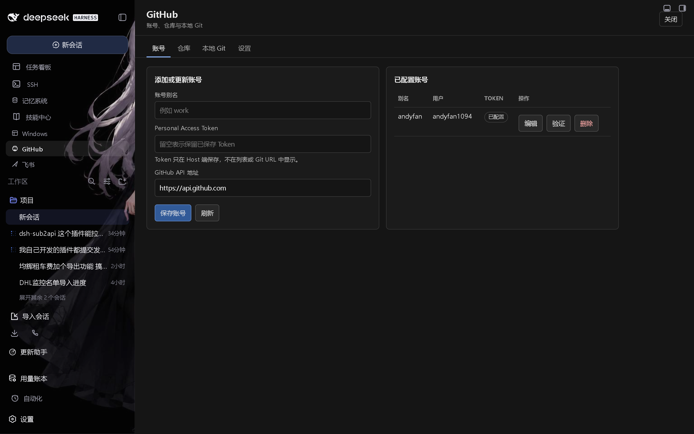

# dsh-github

DSH Web UI 的 GitHub 与本地 Git 工作流插件。

## 功能

- GitHub Personal Access Token 账号管理，摘要信息不回显密钥。
- 支持 github.com 与 GitHub Enterprise API 地址的 REST 仓库列表。
- 本地 Git 操作：clone、快进 pull、status、commit、push 与 force-with-lease。
- 侧边栏面板，含账号、仓库、本地 Git 与设置四个页签。
- push 与 force push 默认关闭，宿主侧双重把关。
- Token 保存在 `~/.dsh/dsh-github.json`，原子写入，权限 0600。
- Git HTTP 认证使用临时的 `http.extraheader` 环境配置；Token 不进 clone URL，也不出现在进程参数里。

## 截图




## 安装到 profile

从 [Releases](https://github.com/andyfan1094/dsh-github/releases) 下载最新的 `dsh-github-*.tgz` 并加入 profile：

```powershell
dsh plugin --profile web add D:\downloads\dsh-github-0.1.2.tgz
```

本地开发可构建后从 checkout 安装：

    pnpm install
    pnpm run build
    dsh plugin --profile web add link:D:\项目\dsh-github

安装后重启现有 DSH Web 进程。打开侧边栏「GitHub」入口，在面板里添加替换用的 Token。本插件刻意不在源码、包元数据、日志或文档中携带任何 Token。

## Agent 工具

- github_auth_list、github_auth_test
- github_repo_list
- github_clone、github_pull、github_status
- github_commit、github_push

## 兼容性

- DSH Host `0.1.0-rc.8` 或更新的兼容版本。
- Node.js `22.19.0` 或更新。
- 需要可通过配置的可执行文件调用 Git。

## 安全

账号文件是本机配置，不是系统级密钥保险库。请使用细粒度 GitHub Token，只授予 DSH 所需的仓库与权限。任何粘贴进聊天或版本库的 Token 都应吊销，并通过面板重新创建。
